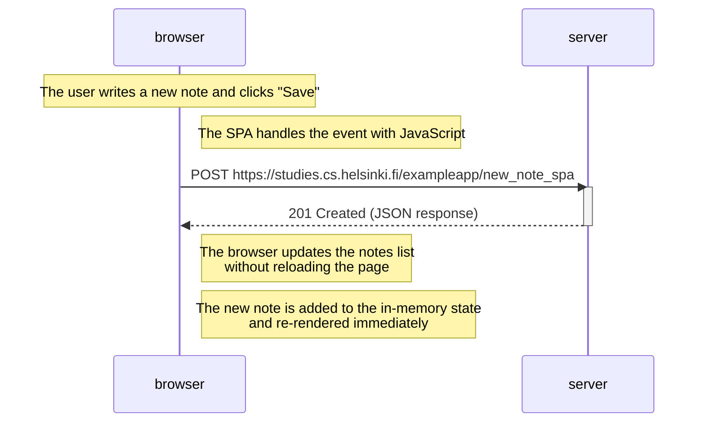

```mermaid
sequenceDiagram
    participant browser
    participant server

    Note over browser: The user writes a new note and clicks "Save"

    Note right of browser: The SPA handles the event with JavaScript

    browser->>server: POST https://studies.cs.helsinki.fi/exampleapp/new_note_spa
    activate server
    server-->>browser: 201 Created (JSON response)
    deactivate server

    Note right of browser: The browser updates the notes list<br>without reloading the page

    Note right of browser: The new note is added to the in‑memory state<br>and re-rendered immediately
```
